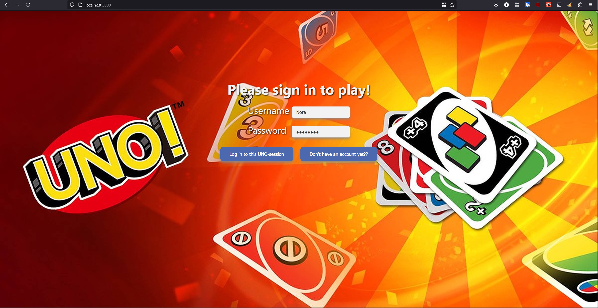
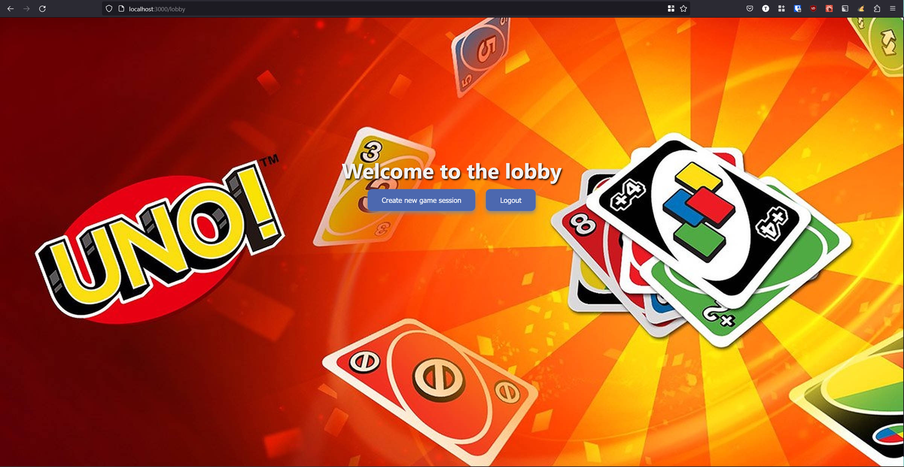
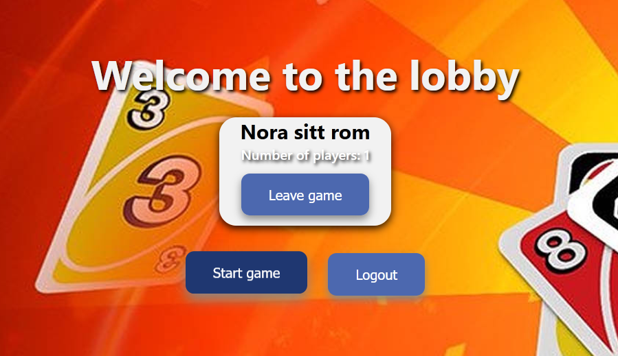
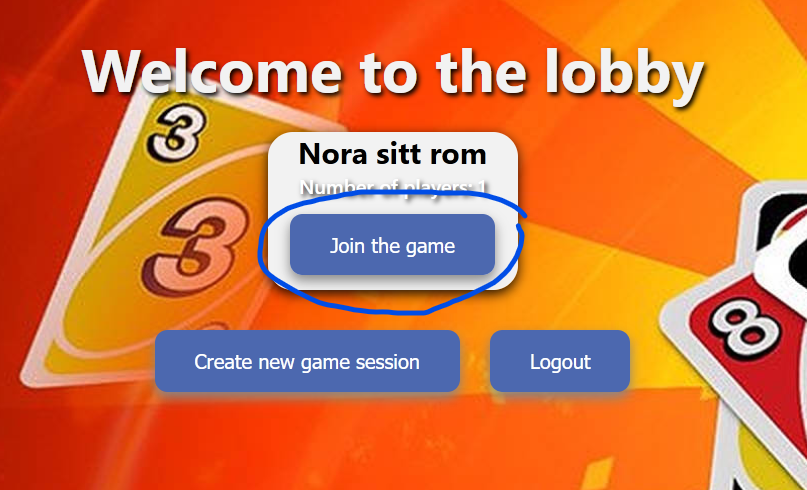
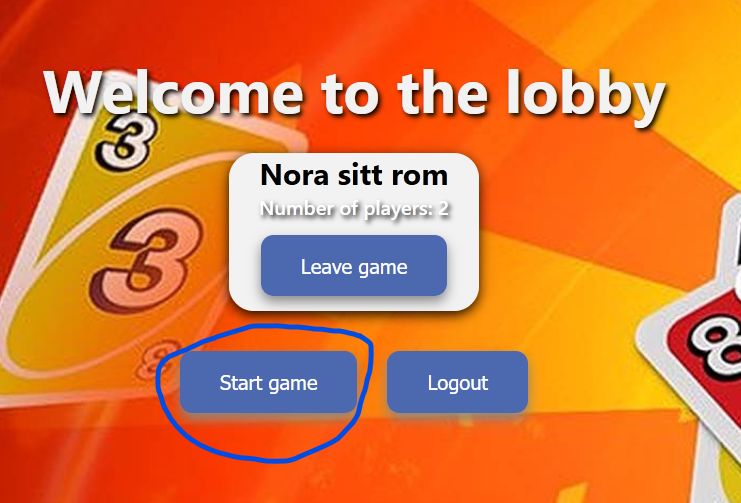
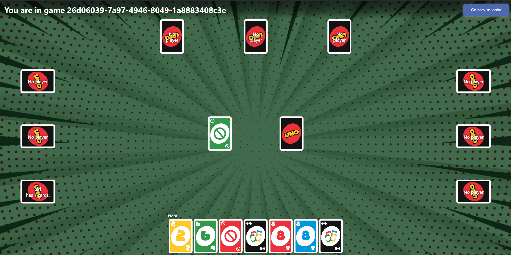
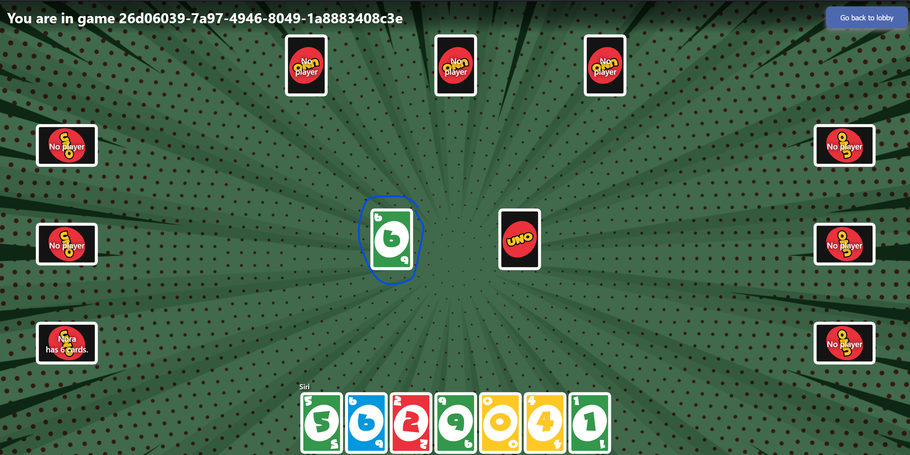

# UnoProsjekt

DAT109 Utviklingsprosjekt - Uno

Prosjektet er gjennomført av:
Nora Kristiansen, Siri Kaarvik Slyk, Elina Tang Wa, Oda Bastesen Storebø, Aurora Sætran, Stian Lødemel, Martin N. Dyrstad

## Kjøre prosjektet

Frontend-prosjektet ligger i Uno/frontend, kjør `npm start` fra denne mappen for å starte React-prosjektet på localhost:3000
Backend-prosjektet ligger i Uno/src, kjør **UnoApplication.java** for å starte backend på localhost:8080

Prosjektet benytter seg av Local Storage, så når man skal teste flere brukere må man benytte forskjellige nettlesere eller privat modus.

---

Registrering ble desverre ikke ferdig, så det er lagt inn test-brukere man kan benytte seg av.

| Brukernavn | Passord  |
| ---------- | :------: |
| User1      | password |
| Nora       | password |
| Siri       | password |

---

## Starte et Uno-spill

Logg inn med to av testbrukerne fra tabellen over, i hver sine nettlesere

Du er nå i lobbyen. Trykk *Create new game session* på en av brukerne

Spillet er nå opprettet, og man kan se hvor mange spillere som er med. Spillet kan ikke startes før det er minst to spillere med.

Bli med i spillet med den andre brukeren.

Start spillet fra brukeren som opprettet spillet.

Du befinner deg nå i spillrommet på begge brukerne. Spilleren som opprettet spillet starter.

Spilte kort vises hos alle brukere.

